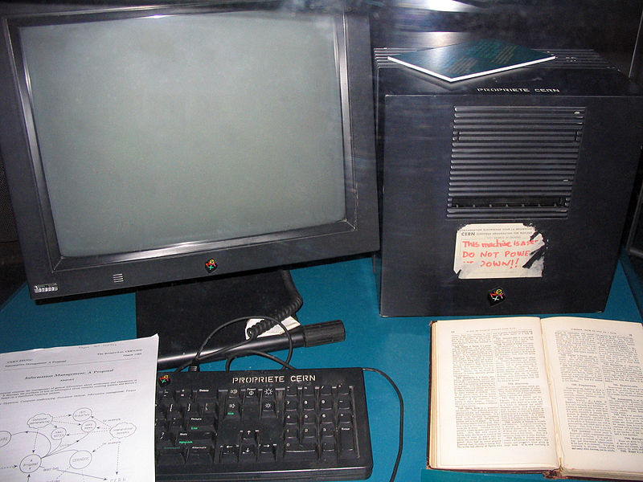

# Fyrirlestur 1.3 — HTML #1

## Vefforritun 1 — TÖL107G

### Ólafur Sverrir Kjartansson, [osk@hi.is](mailto:osk@hi.is)

---

## Texti & upplýsingar

* Frá örófi alda höfum við sagt sögur
* Fyrst manna á milli, síðan á skinni, pappír og bókum
* Núna á _vefnum_

***

## HyperText

* Hugtak um ólínulegan texta sem er tengdur við annan texta og hægt er að nálgast strax
* Skilgreint af [Ted Nelson](https://en.wikipedia.org/wiki/Ted_Nelson) 1963
  - Innblásið af t.d. Vennevar Bush í greininni [„As We May Think“](http://www.theatlantic.com/magazine/archive/1945/07/as-we-may-think/303881/?single_page=true) árið 1945
* Í raunheimum mætti líkja þessu við „Veldu þitt eigið ævintýri“ bækur.

***

## Mother of all Demos

* Í [„Mother of all Demos“](https://www.youtube.com/watch?v=yJDv-zdhzMY) árið 1968 kynnti Douglas Engelbart til sögunnar NLS („oN Line System“)
* Kynnti t.d. músina, [Hypertext](https://www.youtube.com/watch?v=74c8LntW7fo), fjarfundarbúnað o.fl.
* Árið **1968**

***

> The future is already here — it's just not very evenly distributed.
> 
> —William Gibson

***

## Markup Language

* Á einhverjum tímapunkti þurfum við leið til að ljá texta aukna dýpt
* Markup language leyfir okkur það
* Lýsing á skjali sem er setningarfræðilega aðgreind frá texta skjalsins

***

* Lightweight – Einföld setningarfræði sem eykur læsileiki fyrir fólk
* Presentational – WYSIWYG ritlar, markup falið fyrir notanda, t.d. Word

***

* Procedural – markup innifalið í texta sem leiðbeiningar um aðgerðir á textann, t.d. LaTeX
* Descriptive – markup gefur texta merkingu sem er óháður birtingu þess, t.d. HTML

***

## Markdown

```md
### Markdown fyrirsögn

Texti sem inniheldur **feitletraðan** og
_skáletraðan_ texta
með [tengli](http://example.org).

* Listi
* af
* orðum
```

***

## Markdown – birting

### Markdown fyrirsögn

Texti sem inniheldur **feitletraðan** og
_skáletraðan_ texta
með [tengli](http://example.org).

* Listi
* af
* orðum

***

## HTML

* HyperText Markup Language
* Kom fyrst fram á sjónarsviðið 1993, þróað af Tim Berners-Lee
* Útgáfur 1.0–4.01 byggðar á SGML
* Seinni útgáfur, XHTML og HTML5

***

## SGML

* Standard Generalized Markup Language
* [ISO staðall](http://en.wikipedia.org/wiki/International_Organization_for_Standardization) sem skilgreinir almennt markup mál fyrir skjöl
* Byggir á tveimur hugmyndum:
  - Snið ætti að vera lýsandi
  - Snið ætti að vera strangt svo auðvelt sé að vinna úr því

***



***

* ☝️ NeXT tölvan sem Tim Berners-Lee notaði til að skrifa fyrsta vefþjóninn og vafrann
* [Fyrsta vefsíðan](http://info.cern.ch/hypertext/WWW/TheProject.html) varð aðgengileg 23. ágúst 1991, og er enn aðgengileg á sömu slóð í dag

***

## Þróun fyrstu árin

* Fyrstu árin fór þróun fram á póstlistum og hjá einstaklingum sem voru áhugasamir
* [Marc Anderseen stakk upp á ``](http://1997.webhistory.org/www.lists/www-talk.1993q1/0182.html) árið 1993 til að geta birt myndir á vefnum
  - Ennþá eins í dag
  - `">`

***

* Vöfrum fjölgaði…
  - [Line Mode Browser](http://line-mode.cern.ch/)
  - Lynx
  - Mosaic
  - Netscape Navigator
* Vefsíðum fjölgaði…

***

## Staðlar

* Skilgreina í hörgul _hvernig_ HTML á að virka
* Fyrst reynt án árangurs fyrir HTML 1.0 hjá [IETF](https://en.wikipedia.org/wiki/Internet_Engineering_Task_Force) (Internet Engineering Task Force)
* Tókst þó fyrir útgáfu 2.0 í [RFC 1866](https://tools.ietf.org/html/rfc1866) árið 1995
* Tim Berners-Lee stofnaði W3C (World Wide Web Consortium) hjá MIT árið 1994 með stuðning frá Evrópusambandinu og [DARPA](https://en.wikipedia.org/wiki/DARPA)

***

## W3C

* Stofnað af Tim Berners-Lee til að vinna að framþróun vefsins
* Óháð samtök

***

* Sér um staðla og stöðlun á ýmsu tengdum vefnum
  - HTML, CSS en _ekki_ JavaScript
* Stöðlunarferli langt og strangt
  - _Working draft_ → _Candidate recommendation_ → _Proposed recommendation_ → _W3C recommendation_

***

> The primary design principle underlying the Web’s usefulness and growth is universality. […] And it should be accessible from any kind of hardware that can connect to the Internet: stationary or mobile, small screen or large.
>
> — Tim Berners-Lee: [Long Live the Web](http://www.scientificamerican.com/article.cfm?id=long-live-the-web) á 20 ára afmæli vefsins, árið 2010.

---

## „Vafrastríðin“

* Fyrra vafrastríðið varð þegar Microsoft fór að dreifa Internet Explorer ókeypis með Windows í kringum 1997
* Varð valdur að því að Netscape Navigator hvarf (varð þó að Firefox)
* Eftir þetta varð stöðnun hjá vöfrum í mörg ár

***

.svg")

***

* Annað vafrastríðið byrjaði þegar Safari kom út 2003 og Firefox 2004
* Mikil pressa frá vefforriturum að vafrar (sér í lagi IE6) myndu styðja staðla _rétt_
* iPhone kom út 2007, engin öpp í byrjun, bara vefir
* Chrome kom út 2008

***

.svg")

---

## HTML 4

* Staðlað af W3C árið 1997
* Enn byggt á SGML
* Skilgreinir „nútíma“ HTML

***

## Elements

* Einstakur hluti af vefsíðu og býr til tré með öðrum hlutum
* Inniheldur önnur element eða texta nóðu
* Hvert element táknar merkingu, hefur _merkingarfræðilegt gildi_ (e. semantic value)
* `<p>Halló heimur</p>` er element sem skilgreinir setningu (paragraph) með texta nóðuna _„Halló heimur“_

***

## Tags

* Element byrja á tagi, t.d. `<p>`
* Element þurfa ekki, en ættu, að enda á loka tagi, t.d. `</p>`
* Ef element hefur skilgreind _attribute_ eru þau sett á byrjunar tagið

***

* Ef element hefur aðeins byrjunar tag, getum við _sjálflokað því_ (self closing), t.d. `<br/>`
  - Þarf **ekki** í HTML5 og ættum að sleppa

***

Mjög algengt að fólk geri ekki greinarmun á _element_ og _tag_, en það er munur.

***

## Attribute

* Heiti-gildis par sem breytir elementi, t.d. `<p class="important">`
* Gildið þarf ekki að vera umlukið gæsalöppum en það er æskilegt til gildið sé skýrt
* Sum attribute þarf aðeins að skilgreina með heiti, t.d. `<option selected>`

---


## DTD & DOCTYPE

* [Document Type Definition](http://en.wikipedia.org/wiki/Document_type_declaration) (DTD) skilgreinir markup fyrir SGML mál
* [DocType](http://en.wikipedia.org/wiki/Document_type_declaration), eða Document type declaration, skilgreinir hvort og þá hvaða DTD við skrifum eftir

***

## DocType dæmi

```html
&lt;!DOCTYPE HTML PUBLIC
  "-//W3C//DTD HTML 4.01//EN"
  "http://www.w3.org/TR/html4/strict.dtd"
>
```

***

## Af hverju DocType í dag?

* Arfleið frá eldri tíma, segir til um hvort vafri eigi að nota _standards mode_ eða _quirks mode_
* Ef ekkert DOCTYPE þá er quirks mode notað – vafri gerir ráð fyrir að síðan noti eldri, úrelta tækni til að birta síðu
* Ef DOCTYPE bendir á rétt, staðlað DTD er standards mode notað

---

## HTML5

* HTML5 byggir ekki á SGML en er samhæft fyrri útgáfum (backwards compatible)
* Stefnan að auka samvirkni (interoperability) og aðgengi að vefnum
* Brösótt saga, en skilgreint sem fimmta útgáfa HTML í október 2014

***

## HTML5 DocType

Til að vera að fullu samhæft fyrri útgáfum þarf HTML5 að skilgreina DOCTYPE:

```html
&lt;!doctype html>
```

Þetta er _eina_ DOCTYPE sem við notum.

***


---

## Minnsta HTML5 skjalið

```html
&lt;!doctype html>
&lt;html lang="is">
  &lt;head>
    &lt;meta charset="utf-8">
    &lt;title>Halló heimur&lt;/title>
  &lt;/head>
  &lt;body>
    &lt;p>Halló heimur&lt;/p>
  &lt;/body>
&lt;/html>
```
