# Fyrirlestur 2.2 — HTML #3

## Vefforritun 1 — TÖL107G

### Ólafur Sverrir Kjartansson, [osk@hi.is](mailto:osk@hi.is)

---


## Minnsta HTML5 skjalið

```html
&lt;!doctype html>
&lt;html lang="is">
  &lt;head>
    &lt;meta charset="utf-8">
    &lt;title>Halló heimur&lt;/title>
  &lt;/head>
  &lt;body>
    &lt;p>Halló heimur&lt;/p>
  &lt;/body>
&lt;/html>
```

***

## `<html>`

* Rót HTML síðu er alltaf skilgreind með `<html>`
* `lang` attribute er æskilegt þar sem það skilgreinir á hvaða máli síðan er og er notuð af t.d. lesvöfrum til að velja tungumál
* Hægt er að skilgreina tungumál á öðrum texta innan síðu með lang á elementi utan um textann: `<p lang="en">Hello world!</p>`

***

## `<head>`

* `<head>` er yfirleitt fyrsta barn `<html>`
* Skilgreinum lýsigögn um síðuna okkar hér
* Í minnsta lagi skilgreinum við:
  - Í hvaða stafasetti síðan okkar er, `<meta charset="utf-8">`
  - Titil síðunnar - `<title>`

***

## `<body>`

* Skilgreinum meginmál síðunnar í `<body>`
* Myndar _tré_ af elementum

***

## HTML Element

* Element sem við getum notað í HTML eru skilgreind í HTML _specification_ eða _spec_
* https://html.spec.whatwg.org/ fyrir **allan** spec
* WHATWG heldur úti spec fyrir forritara á https://html.spec.whatwg.org/dev/

***

## Element

HTML skilgreinir element og er þeim skipt í hópa:



***

## Að lesa speccinn

[The `a` element](https://html.spec.whatwg.org/multipage/text-level-semantics.html#the-a-element)

* _Categories_, hvaða flokkum tilheyrir elementið
* _Context_, hvar má nota elementið
* _Content model_, hvaða efni má fara í elementið
* _Content attributes_, hvaða attribute má nota

[The `a` element í dev spec](https://html.spec.whatwg.org/dev/text-level-semantics.html#the-a-element)

***

## Global attributes

* Öll element mega fá á sig tæmandi lista af global attributes, af þeim ber helst að nefna:
* `id`, skilgreinir auðkenni á element sem notað er í CSS eða til uppflettingar í DOM
  - **hvert `id` skilgreint einu sinni per síðu**

***

* `class`, flokkar (skipt á bili) sem elementið tilheyrir, mikið notað í CSS. Flokkanöfn ættu að vera lýsandi fyrir hegðun en ekki útlit (`class="important"` ekki `class="red"`)
* `title`, texti með auka upplýsingum um element sem oftast birtist sem _tooltip_ þegar mús er haldið yfir elementinu

***

## Flow – flæði

Flest element í meginmáli, `<body>`, vefs eru _flæði_ element.

Nokkur element eru flæði element og innihalda _greinilegt_ efni (palpable content) en falla ekki í aðra flokka

***

* `<main>` sem skilgreinir megin efni vefs, einu sinni per vefsíðu.
* `<header>` skilgreinir hóp af efni sem kynnir eða veitir leiðsögn
* `<footer>` skilgreinir efni um það element sem það er innihaldið í, tilgreinir t.d. höfund
* `<pre>`, _preformatted_, texti innan `<pre>` er óstílaður af vafra og viðheldur bilum og línubilum
* Töflur og listar

***

* `<div>` er element sem hefur enga eiginlega merkingu, merking þess er skilgreint af því sem það inniheldur
* Grípum til þess þegar við finnum ekki betra element

***

> Authors are strongly encouraged to view the `div` element as an element of last resort, for when no other element is suitable. Use of more appropriate elements instead of the `div` element leads to better accessibility for readers and easier maintainability for authors.
> 
> — [Grouping content: The div element](https://html.spec.whatwg.org/multipage/grouping-content.html#the-div-element) 

***

## Metadata – lýsigögn

* Lýsigögn eru ekki efni sem notandi neytir beint, heldur lýsir vefnum á einhvern máta
* `<link>` lýsir tengingu við önnur gögn. Ef `rel` attribute er sett þá einskorðast `<link>` við `<head>`
  - `rel="stylesheet"` sækir CSS skrá til að birta

***

* `<meta>` skilgreinir margskonar lýsigögn, t.d. stafasett (charset)
* `<script>` inniheldur kóða og gögn á vef

***

## Sectioning – kaflar og svæði

* `<article>` er fyrir efni sem stendur sjálfstætt innan vef, t.d. grein, athugasemd
* `<aside>` er fyrir efni sem er tengt efni í kringum element, t.d. útdrátt sem gert er hærra undir höfði

***

* `<nav>` heldur utan um leiðarkerfi fyrir vef
* `<section>` skilgreinir kafla á vef, heldur utan um svipað efni, oftast með fyrirsögn

***

## Áður…

```html
&lt;body>
  &lt;div id="main">
    &lt;div id="header">
      &lt;div id="nav">&lt;/div>
    &lt;/div>
    &lt;div class="article">
      &lt;div class="section">&lt;/div>
    &lt;/div>
    &lt;div id="footer">&lt;/div>
  &lt;/div>
&lt;/body>
```

***

## Núna

```html
&lt;body>
  &lt;main>
    &lt;header>
      &lt;nav>&lt;/nav>
    &lt;/header>
    &lt;article>
      &lt;section>&lt;/section>
    &lt;/article>
    &lt;footer>&lt;/footer>
  &lt;/main>
&lt;/body>
```

***

## Heading – fyrirsagnir

* Skilgreinum fyrirsagnir með `<h1>` til `<h6>`, í minnkandi mikilvægisröð
* Síður, kaflar og svæði hafa sínar fyrirsagnir
* Síða hefur skilgreinda útlínu sem skilgreinist af köflum, svæðum og fyrirsögnum
* Skilgreinum í réttri röð

***

```html
<main>
  <h1>Aðalfyrirsögn, aðeins 1x</h1>
  <section>
    <h2>Kaflaheiti</h2>
    <h3>Millifyrirsögn</h3>
  </section>
  <section>
    <h3>Ónei, ég ætti að vera h2</h3>
  </section>
</main>
```

***

## Phrasing – orðalag

* `<p>`, málsgrein, skilgreinir í flestum tilfellum texta
* `<em>`, leggur áherslu á texta
* `<strong>`, gefur texta mikið auka vægi
* `<span>`, merkir ekkert í sjálfu sér og er skilgreint af börnum sínum, svipar til `<div>`
* `<code>`, merkir forritunarkóða

***

## Embedded – innfellt

* `` bætir mynd við, vísað í með `src` attribute
* `<audio>` bætir hljóðskrá við
* `<video>` bætir myndbandi við
* `<object>` bætir við utanaðkomandi auðlind, sem gæti verið meðhöndluð af vafra ef þekkt eða sem plugin (t.d. Flash)

***

## Interactive – gagnvirkt

Sum element eru, eða geta verið, gagnvirk fyrir notanda, t.d.:

* `<a>` tengir vefi saman, hyperlink. `href` attribute þarf að vera til staðar til að element sé virkur tengill
* `<audio>` og `<video>` geta skilgreint stýri attribute og eru þá gagnvirk
* `<input>` taka við gögnum frá notenda, sérstaklega í formum

***

## Listar

* `<ol>` lýsir röðuðum lista (ordered list)
* `<ul>` lýsir óröðuðum lista (unordered list)
* `<li>` skilgreinir hlut í `<ol>` eða `<ul>` (list item)
* `<dl>` lýsir lista af nöfnum og gildum (description list), t.d. skilgreiningar, spurningar &amp; svör, notað með `<dt>` og `<dd>`

***

## Dæmi

<ol>
  <li>Læra vefforritun</li>
  <li>???</li>
  <li>Gróði!</li>
</ol>

***

```html
<ol>
  <li>Læra vefforritun</li>
  <li>???</li>
  <li>Gróði!</li>
</ol>
```

***

<div>
<dl>
  <dt>HTML</dt>
  <dd>HyperText Markup Language</dd>
  <dd>Búið til af Tim Berners-Lee</dd>
</dl>
</div>

***

```html
<dl>
  <dt>HTML</dt>
  <dd>HyperText Markup Language</dd>
  <dd>Búið til af Tim Berners-Lee</dd>
</dl>
```

***

## Valmynd

Oftast er `<nav>`, `<ul>` og `<a>` notað saman til að útbúa valmynd:

```html
<nav>
  <ul>
    <li><a href="/">Forsíða</a></li>
    <li><a href="/about">Um</a></li>
  </ul>
</nav>
```

***

## Dæmi

* [Lýsigögn](daemi/meta.html)
* [Innfellt efni](daemi/embedded.html)
* [Valmynd](daemi/nav.html)

---

## Töflur

* `<table>` skilgreinir töflu
* `<caption>` lýsir gögnum í töflu
* `<thead>` fyrirsagnir í haus töflu, t.d. listi af dálkum
* `<tbody>` meginmál töflu
* `<tfoot>` fótur töflu, samantekt, t.d. samtölur

***

* `<tr>` er röð af reitum í töflu
* `<th>` er reitur með fyrirsögn í töflu, getur komið fyrir innan `<tr>` bæði í haus og í byrjun raða
* `<td>` er reitur með gögnum

***

## Attributes á töflum

* `colspan` á `<th>` og `<td>` — tala, stærri en 0 sem skilgreinir hversu marga dálka reitur nær
* `rowspan` á `<th>` og `<td>` — tala, stærri en 0 sem skilgreinir hversu margar raðir reitur nær
* `scope` á `<th>` — skilgreinir hvort `<th>` eigi við röð (row) eða dálk (col)

***

<div>
<table>
  <thead>
    <tr>
      <th>Vara</th>
      <th>Lýsing</th>
      <th>Verð</th>
    </tr>
  </thead>
  <tbody>
    <tr>
      <td>Sími</td>
      <td>Frábær sími!</td>
      <td>150.000 kr.-</td>
    </tr>
    <tr>
      <td>Tölva</td>
      <td>Einstök tölva!</td>
      <td>100.000 kr.-</td>
    </tr>
  </tbody>
  <tfoot>
    <tr>
      <td colspan="2">Tveir hlutir</td>
      <td><strong>250.000 kr.-</strong></td>
    </tr>
  </tfoot>
</table>
</div>

***

```html
&lt;table>
  &lt;thead>
    &lt;tr>
      &lt;th>Vara&lt;/th>
      &lt;th>Lýsing&lt;/th>
      &lt;th>Verð&lt;/th>
    &lt;/tr>
  &lt;/thead>
```

***

```html
  &lt;tbody>
    &lt;tr>
      &lt;td>Sími&lt;/td>
      &lt;td>Frábær sími!&lt;/td>
      &lt;td>150.000 kr.-&lt;/td>
    &lt;/tr>
    ...
  &lt;/tbody>
```

***

```html
  &lt;tfoot>
    &lt;tr>
      &lt;td colspan="2">Tveir hlutir&lt;/td>
      &lt;td>&lt;strong>250.000 kr.-&lt;/strong>&lt;/td>
    &lt;/tr>
  &lt;/tfoot>
&lt;/table>
```

***

## Dæmi

* [Tafla](daemi/table.html)

---

## Form

* `<form>` stendur fyrir samansafn af gögnum sem hægt er að vinna með og senda á þjón til úrvinnslu
  - `method` attribute skilgreinir hvort `GET` eða `POST` HTTP aðgerð (notum yfirleitt `GET` nema við séum að senda á bakenda)
  - `action` attribute skilgreinir _hvert_ form sendir, á URL

***

## Form element

* `<label>` merkir reiti í formi
  - Skilgreinum hérumbil alltaf
* `<textarea>` er reitur fyrir margar línur af texta

***

* `<input>` er gagna reitur sem leyfir notanda að slá inn eða eiga við gögn
  - HTML5 bætti við helling af nýjum týpum, mismunandi vel studdar
* `<select>` leyfir val á hlutum úr fyrirfram völdum lista

***

* `<fieldset>` hópar hluta af formi saman, t.d. fyrir persónuupplýsingar
* `<legend>` er heiti á `<fieldset>`

***

## Tegundir af `input`

* <input type="text"> — `<input type="text">`
* <input type="radio"> — `<input type="radio">`
* <input type="checkbox"> — `<input type="checkbox">`, hópað saman eftir `name`
* <input type="search"> — `<input type="search">`
* <input type="email"> — `<input type="email">`

***

* <input type="url"> — `<input type="url">`
* <input type="tel"> — `<input type="tel">`
* <input type="number"> — `<input type="number">`
* <input type="range"> — `<input type="range">`
* <input type="date"> — `<input type="date">`

***

* <input type="week"> — `<input type="week">`
* <input type="time"> — `<input type="time">`
* <input type="datetime-local"> — `<input type="datetime-local">`
* <input type="color"> — `<input type="color">`

***

## Attributes á `input`

* `name` — nafn á breytu, það sem sendist á bakenda til úrvinnslu
* `required` — innsláttar krafist
* `placeholder` — texti sem er til staðar þar til slegið er inn

***

* `disabled` hvort hægt sé að skrá gögn eða ekki.
* `novalidate` — ekki keyra villutjékk
* o.fl.

***

<div class="field">
  <form>
    <label for="email">Email:</label>
    <input type="email" name="email" id="email" required>
    <input type="submit" value="Senda">
  </form>
</div>

```html
<div class="field">
  <label for="email">Email:</label>
  <input type="email" name="email" id="email" required>
</div>
```

***

<fieldset>
  <legend>Uppáhalds litur</legend>
  <label>
    <input name="color" type="radio" value="red">
    Rauður
    </label>
  <label>
    <input name="color" type="radio" value="green">
    Grænn
  </label>
</fieldset>

***

```html
<fieldset>
  <legend>Uppáhalds litur</legend>
  <label>
    <input name="color" type="radio" value="red">
    Rauður
    </label>
  <label>
    <input name="color" type="radio" value="green">
    Grænn
  </label>
</fieldset>
```

***

<div>
  <form method="post">
    <input
      type="text" pattern="[0-9]{1,2}-[0-9]{7}"
      required placeholder="00-1234567">
    <input type="submit" value="Senda">
  </form>
</div>

```html
<input
  type="text"
  pattern="[0-9]{1,2}-[0-9]{7}"
  required
  autofocus
  placeholder="00-1234567"
>
```

***

## Dæmi

* [Form](daemi/form.html)

---

## Að velja element

* Þegar við erum að velja element viljum við velja element sem á sem _mest við_
* Lesum í _merkingarfræði_ elements
* Getum flett upp:

***

* [Skilgreiningar W3C](https://w3c.github.io/html/dom.html#kinds-of-content)
* [HTML5 Element Index hjá HTML5 Doctor](http://html5doctor.com/element-index/)
* [MDN: HTML element reference](https://developer.mozilla.org/en/docs/Web/HTML/Element)
* [W3C: The Elements of HTML](https://w3c.github.io/elements-of-html/)

***

## Merkingarfræði

* Það er sterklega mælst til þess að markup í HTML skjali sé aðeins notað til að tjá merkingu en ekki framsetningu
* Framsetning á gögnum er stýrt með CSS og fáum við því hreina skiptingu á milli efnis og útlits
* Mörg element til sem skilgreina merkingu en annars er hægt að nota attributes

***

## Dæmi

```html
<b>Fyrirsögn</b>
<br>Halló heimur
```

<div>
  <b>Fyrirsögn</b>
  <br>Halló heimur
</div>

```html
<h2>Fyrirsögn</h2>
<p>Halló heimur</p>
```

<div>
  <h2 style='margin-bottom: 0; text-transform: none'>Fyrirsögn</h2>
  <p style='margin-top: 0;'>Halló heimur</p>
</div>

***

## Af hverju merkingarfræði?

* Aðskilnaður á milli merkingar og útlits gerir manni auðveldara að breyta öðru án þess að hafa áhrif á hitt
* Einfaldar viðhald, breytingar eru dýrar
* Góð merkingarfræði getur aukið aðgengi að vef

***

* Vélar sem skoða vef með merkingarfræðilega réttu HTML geta dregið ályktanir um efnið sem getur gagnast þér og öðrum
  - T.d. Googlebot, Pocket, Instapaper
* Vafrar geta birt efni á nytsamlegan hátt sem höfundur hafði ekki dottið í hug
* Það er _snyrtilegra_ og _faglegra_

***

## Áður fyrr…

* Merkingu og framsetningu var blandað óhikað saman
* Töflur ásamt ósýnilegum myndum (spacer gif) notaðar til að stýra útliti
* `<FONT>` notað til að stýra stærð og lit á letri
  - `<FONT size="12" color="red" face="Comic Sans MS">Halló heimur!</FONT>`

***

* Hjálpsemi og samhæfni nútíma vafra gera okkur þó kleyft að birta fjörgamalt HTML sem engin ætti að nota

<div>
  <font size="12" color="red" face="Comic Sans MS">Halló heimur!</font>
</div>

```html
<font size="12" color="red" face="Comic Sans MS">
  Halló heimur!
</font>
```

***

## Úrelt element

* Búið að fjarlægja element sem notuð voru aðeins til birtingar, t.d. `<center>`og `<font>`
* Einnig búið að fjarlægja attribute af sama meiði, t.d. `align`, `background`, `bgcolor` og `border`

***

* Skrifum HTML þannig að beri merkingu
* Stýrum framsetningu með CSS
* Fáum hreina skiptingu milli efnis og útlits

***

## `<div>` & `<span>`

* Ómerkingarbær element en notuð þegar ekkert annað _á&nbsp;við_
* `<div>` – division, skiptir síðu, _block level_, fyllir út í lárétt pláss foreldris
* `<span>` – merkir texta. Inline, fellur inn í nærliggjandi texta

***

## Merkingarfræðileg siðvendni

* Verður allt að vera 100% merkingarfræðilegt og má aldrei nota `<div>` eða `<span>`?
* Höfum merkingarfræði í huga og gerum okkar besta
* Einbeitum okkur að því að að skrifa snyrtilegt og gott HTML!
* Eyðum ekki of löngum tíma í að finna hið eina rétta element, notum `<div>` eða `<span>` ef svo ber við
