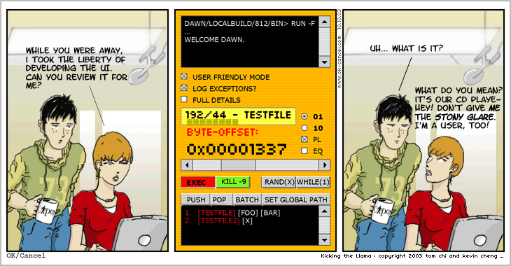
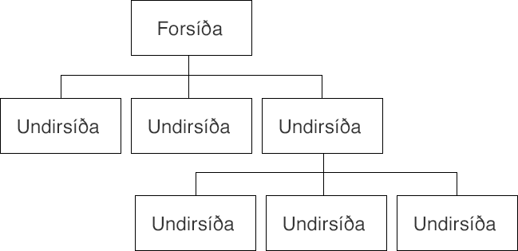

# Fyrirlestur 5.3 – Hönnun

## Vefforritun 1 — TÖL107G

### Ólafur Sverrir Kjartansson, [osk@hi.is](mailto:osk@hi.is)

---

## Hönnun

* Þó að við lítum ekki á okkur sem „hönnuði“ getum við lært að búa til útlit sem eru fín
* Vefforritarar lenda oft í því að þurfa að hanna útlit, þó lítið sé
* Viljum forðast að búa til „forritaraútlit“

***



***

## Röðun og jöfnun (alignment)

* Röðun og jöfnun skiptir máli
* Ættum að leggja okkur fram við að setja hluti skipulega upp með reglu
* Notkun á grind hjálpar mikið!
* Bil ættu ekki að vera handahófskennd heldur fylgja reglu
* [Dæmi](daemi/design/alignment.html)

***

## Hópun

* Þegar við erum að skipuleggja efni er mikilvægt að huga að hópun
* Hlutir sem eiga að vera saman ættu að vera saman og ættu að vera líkir
* Þetta getur átt við allt frá listum, til upplýsinga í fæti til mynda og texta tengdum þeim
* [Dæmi](daemi/design/proximity.html)

***

## Andstæður (contrast)

* Andstæður  myndast þegar hlutir eru ólíkir, ekki aðeins ólíkir heldur mjög ólíkir
* Með þvi getum við dregið athygli að ákveðnum hlutum og brotið upp hönnun

***

* Andstæður er hægt að mynda með letri: mismunandi leturgerð, mismunandi þyngd eða mismunandi stærð.
* Eða litum: með því að snúa við litum á bakgrunni og letri
* [Dæmi](daemi/design/contrast.html)

***

## Letur

* Vöndum val á leturgerðum
  - Ekki allar leturgerðir eru ekki gerðar til þess að vera á meginmáli eða fyrirsögnum
* Veljum leturgerðir sem bjóða upp á andstæður!
* Stærðir á letri ættu ekki að vera handahófskenndar
  - Getum skilgreint _týpografískan skala_, t.d. `12 14 16 18 21 24 36 48`

***

## Vertical rhythm

* Lóðréttur taktur texta
* Eins og lóðrétt grind
* Gefum ekki pláss í grunninn sem _hver lína af texta_ þarf að passa innan margfeldis af
* [Dæmi](daemi/design/vertical-rhythm.html)

***

## Litir

* Ættum að ákveða litapallettu og nota hana
* Margar leiðir til að velja liti, gott að nota tól
  - [Adobe Color](https://color.adobe.com/)
  - [Sessions collage: Color Calculator](https://www.sessions.edu/color-calculator/)

***

## Veftré

* Áður en við förum beint _að hanna_ vef er mikilvægt að greina umfangi
* Til þess að komast að því er gott að byrja á að því að setja upp _veftré_
  - Yfirlitsmynd yfir allar síður vefsins og hvernig þær tengjast innbyrðist

***



***

## Wireframe

* Wireframe er það að taka hverja síðu/„síðutýpu“ og skissa upp hvernig hún mun líta út
* Blað og blýanti, á tússtöflu eða í tóli (t.d. [balsamiq](https://balsamiq.com/))
* Þetta gefur okkur tilfinningu fyrir því hvaða efni þurfi að vera á hverri síðu, í hvaða forgangi það eigi að vera og hvernig það tengist öðru efni

***


***

## Bootstrap

* Ef við treystum okkur ekki í að hanna eigið útlit getum við fengið hjálp
* [Bootstrap](https://getbootstrap.com/) er _framenda hlutasafn_ (frontend component library)
  - Notum ákveðna klasa í HTML og fáum smekklegt útlit án mikils tilkostnaðar
  - Nema að vefurinn okkar er frekar líkur frekar mörgum vefjum...

***

```html
<div class="jumbotron">
  <h1 class="display-3">Hello, world!</h1>
  <p class="lead">Extra text</p>
  <p class="lead">
    <button
      class="btn btn-primary btn-lg"
      href="#"
    >
      Learn more
    </a>
  </p>
</div>
```

***


***

## Tailwind

* [Tailwind](https://tailwindcss.com/) CSS framework sem byggir á að nota hjálparklasa (utility classes)
* Fáum ekki tilbúna hluti, setjum þá saman með allskonar klösum

***

```html
<div class="md:flex">
  <div class="md:flex-shrink-0">
    
  </div>
  <div class="mt-4 md:mt-0 md:ml-6">
    <div class="uppercase tracking-wide text-sm text-indigo-600 font-bold">Marketing</div>
    <a href="#" class="block mt-1 text-lg leading-tight font-semibold text-gray-900 hover:underline">
      Finding customers for your new business
    </a>
    <p class="mt-2 text-gray-600">
      Getting a new business off the ground is a lot of hard work.
      Here are five ideas you can use to find your first customers.
    </p>
  </div>
</div>
```

***


