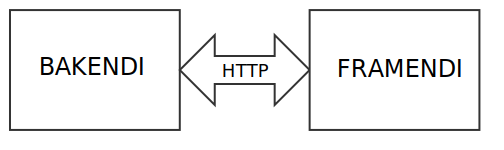

# Fyrirlestur 13.1 – Almenn hugtök/HTML upprifjun

## Vefforritun 1 — TÖL107G

### Ólafur Sverrir Kjartansson, [osk@hi.is](mailto:osk@hi.is)

---

## CLI

* _Command-line interface_
* Texta viðmót á forrit, ólíkt _grafísku_ viðmóti
* Skrifum skipanir, keyrum forrit og fáum texta niðurstöðu
* `cmd` á Windows, `Terminal` á Mac/Linux
  - Förum nánar í seinna

***

## Internetið

* Alþjóðlegt netkerfi hundruð milljóna tölva tengdra saman yfir tugþúsundir neta
* Notar TCP/IP samskiptareglur
* Margskonar kerfi nýta internetið, t.d. vefurinn og tölvupóstur

***

## IP tölur

* Aðgreina og staðsetja tæki tengd internetinu
* IPv4 tölur eru 32 bita tölur, myndaðar úr fjórum tölum með `.` á milli
  * Aðeins `2³² = 4.294.967.296` tölur, búnar!
  * T.d. `130.208.165.186`

***

## Vefurinn

* World Wide Web!
* Aðgengilegur yfir _internetið_
* Byggir á _vefsíðum_ sem eiga sér _URL_
* Sóttar yfir _HTTP_

***

## HTTP

* HyperText Transfer Protocol
* Samskiptareglur sem skilgreina hvernig dreift kerfi tölva vinnur saman

***

## URL

* Staðsetja og skilgreina hvernig við sækjum vefsíður yfir HTTP
* Samanstanda af nokkrum pörtum
* `http://example.org/example.html?start=true#kafli2`
* Stundum er talað um `URI`, en í nýjum staðli er `URL` og `URI` það sama

***

## Vafri

* Forrit sem leyfir okkur að skoða og njóta vefsins
* Túlkar _HTML_, _CSS_ og _JavaScript_ og birtir notanda
* Flókin forrit sem geta birt allskonar efni
* Byggja á opnum stöðlum

***

## Framendi

* Framendi (e. front-end eða client-side) er sá partur vefsins sem notendur sjá og eiga við
* Búinn til með HTML, CSS og JavaScript

***

## Framendi VS bakendi



---

## HyperText

* Hugtak um ólínulegan texta sem er tengdur við annan texta og hægt er að nálgast strax
* Skilgreint af [Ted Nelson](https://en.wikipedia.org/wiki/Ted_Nelson) 1963
  - Innblásið af t.d. Vennevar Bush í greininni [„As We May Think“](http://www.theatlantic.com/magazine/archive/1945/07/as-we-may-think/303881/?single_page=true) árið 1945
* Í raunheimum mætti líkja þessu við „Veldu þitt eigið ævintýri“ bækur.

***

## Markup Language

* Á einhverjum tímapunkti þurfum við leið til að ljá texta aukna dýpt
* Markup language leyfir okkur það
* Lýsing á skjali sem er setningarfræðilega aðgreind frá texta skjalsins

***

## HTML

* HyperText Markup Language
* Kom fyrst fram á sjónarsviðið 1993, þróað af Tim Berners-Lee
* Útgáfur 1.0–4.01 byggðar á SGML
* Seinni útgáfur, XHTML og HTML5

***

## W3C

* Stofnað af Tim Berners-Lee til að vinna að framþróun vefsins
* Óháð samtök

***

## Elements

* Einstakur hluti af vefsíðu og býr til tré með öðrum hlutum
* Inniheldur önnur element eða texta nóðu
* Hvert element táknar merkingu, hefur _merkingarfræðilegt gildi_ (e. semantic value)
* `<p>Halló heimur</p>` er element sem skilgreinir setningu (paragraph) með texta nóðuna _„Halló heimur“_

***

## Tags

* Element byrja á tagi, t.d. `<p>`
* Element þurfa ekki, en ættu, að enda á loka tagi, t.d. `</p>`
* Ef element hefur skilgreind _attribute_ eru þau sett á byrjunar tagið

***

## Minnsta HTML5 skjalið

```html
&lt;!doctype html>
&lt;html lang="is">
  &lt;head>
    &lt;meta charset="utf-8">
    &lt;title>Halló heimur&lt;/title>
  &lt;/head>
  &lt;body>
    &lt;p>Halló heimur&lt;/p>
  &lt;/body>
&lt;/html>
```

***

## Að skrifa HTML

* Skrifum snyrtilegt HTML
  - Fylgjum (yfirleitt) þeim kröfum sem XHTML setur á málfræði
* Pössum upp á inndráttinn
  - Whitespace (bil og nýjarlínur) er ekki mikilvægt í HTML, þ.a. mörg bil og mörgum línum er breytt í eitt bil

***

> Kóði lýsir innri manneskju  
> &nbsp;
> —Óli

***

## _Linting_

* Almennt köllum við það _linting_ að lesa yfir kóða og benda á möguleg vandamál
* Til fyrir langflest forritunarmál
* Oftast tvenns konar villur
  - Mögulegar villur við keyrslu
  - Brot á kóðastíl

***

## Að vísa í efni

* Þegar við vísum í efni þurfum við að gefa upp slóð
  - _Afstæð_ (relative) eða _nákvæm_ (absolute)
* Á við ``, `<a href="">` og önnur element sem vísa í efni

***

## `<html>`

* Rót HTML síðu er alltaf skilgreind með `<html>`
* `lang` attribute er æskilegt þar sem það skilgreinir á hvaða máli síðan er og er notuð af t.d. lesvöfrum til að velja tungumál
* Hægt er að skilgreina tungumál á öðrum texta innan síðu með lang á elementi utan um textann: `<p lang="en">Hello world!</p>`

***

## `<head>`

* `<head>` er yfirleitt fyrsta barn `<html>`
* Skilgreinum lýsigögn um síðuna okkar hér
* Í minnsta lagi skilgreinum við:
  - Í hvaða stafasetti síðan okkar er, `<meta charset="utf-8">`
  - Titil síðunnar - `<title>`

***

## `<body>`

* Skilgreinum meginmál síðunnar í `<body>`
* Myndar _tré_ af elementum

***

## HTML Element

* Element sem við getum notað í HTML eru skilgreind í HTML _specification_ eða _spec_
* https://html.spec.whatwg.org/ fyrir **allan** spec
* WHATWG heldur úti spec fyrir forritara á https://html.spec.whatwg.org/dev/

***

## Element

HTML skilgreinir element og er þeim skipt í hópa:


---

## Aðgengi

* Aðgengi snýst ekki um að fatlað fólk geti notað vefina okkar
* Aðgengi snýst um að _fólk_ geti notað vefina okkar
* Við getum öll orðið „fötluð“ tímabundið

***

## Af hverju aðgengi?

* Viljum ekki mismuna fólki vegna fötlunar
* Getur verið mjög dýrt að gera aðgengilegt eftir á
* Samlegðaráhrif! Vefurinn okkar verður betri fyrir alla
* Lagasetningar (munu?) banna okkur að mismuna fólki á vefnum

***

## WCAG 2.1

* W3C staðall
* Listi af tilmælum og prinsippum til að gera vefi aðgengilegri
* Þrjár tegundir:
  - A, minnsta stig
  - AA, það stig sem við ættum að stefna að
  - AAA, öll skilyrði uppfyllt

***

## Leitarvélabestun / SEO

* Meðhöndlun á efni til að það komi frekar fram í leitarniðurstöðum
* Leitarvélar horfa á mörg hundruð breytur sem hafa áhrif
* Í grunninn _skipulagt_, _læsilegt_ og _einstakt_ efni

***

## Skilgreina lýsigögn

* Lýsigögn fyrir vef ættu að vera sett upp fyrir helstu þjónustur
  - t.d. [Facebook](https://developers.facebook.com/docs/sharing/webmasters) og [Twitter](https://dev.twitter.com/cards/markup)
* Minnstu upplýsingar sem ætti að skilgreina fyrir vefi svo helstu þjónustur birti viðeigandi upplýsingar eru titill, lýsing og mynd
